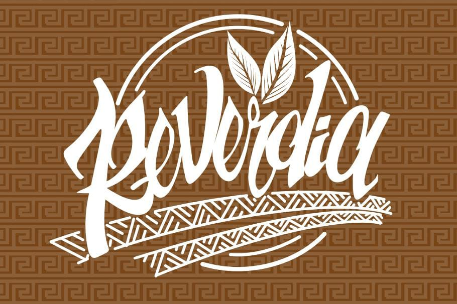

<!DOCTYPE html>
<html lang="en">
<head>
  <link rel="stylesheet" type="text/css" href="estilo.css">
  <link rel="icon" type="text/css" href="imagenes/reverdiaico.ico">
  <link rel="stylesheet" href="https://stackpath.bootstrapcdn.com/font-awesome/4.7.0/css/font-awesome.min.css">
  <title>Reverdia</title>
  <meta charset="utf-8">
  <meta name="viewport" content="width=device-width, initial-scale=1">
  <link href="https://cdn.jsdelivr.net/npm/bootstrap@5.3.2/dist/css/bootstrap.min.css" rel="stylesheet">
  
</head>
<body>
    

    <header>
<nav class="navbar navbar-expand-sm  ">
  

    
    <button class="navbar-toggler" type="button" data-bs-toggle="collapse" data-bs-target="#mynavbar">
      
    </button>
    

      <ul class="navbar-nav me-auto">
        <li class="nav-item">
        <a class="tex1" class="nav-link" href="Chocolinos.html">Chocolinos</a>
        </li>
        <li class="nav-item">
          <a class="tex1"class="nav-link" href="Saman.html">Saman</a>
        </li>
        <li class="nav-item">
          <a class="tex1"class="nav-link" href="Sutra.html">Sutra</a>
        </li>
        <li class="nav-item"></li>
          <a class="tex1" class="nav-link" href="contactenos.html">Contactenos</a>
      </ul>
      <form class="d-flex">
        <input class="form-control me-2" type="text" placeholder="Buscar">
        <button class="btn btn-outline-warning" type="button">Buscar</button>
      </form>
    

  

</nav>
  </header> 

  <!-- Carousel -->

  <!-- Indicators/dots -->
  

    <button type="button" data-bs-target="#demo" data-bs-slide-to="0" class="active"></button>
    <button type="button" data-bs-target="#demo" data-bs-slide-to="1"></button>
    <button type="button" data-bs-target="#demo" data-bs-slide-to="2"></button>
    <button type="button" data-bs-target="#demo" data-bs-slide-to="3"></button>
  

  
  <!-- The slideshow/carousel -->
  

    

      
    

    

      
    

    

      
    

     

      
    

  

  
  <!-- Left and right controls/icons -->
  <button class="carousel-control-prev" type="button" data-bs-target="#demo" data-bs-slide="prev">
    
  </button>
  <button class="carousel-control-next" type="button" data-bs-target="#demo" data-bs-slide="next">
    
  </button>

  <!-- Carousel wrapper -->

  <!-- Controls -->
  
  <!-- Inner -->
  

    <!-- Single item -->
    

      

        

          

            

              
              

                <h5 class="card-title">ChoColinos</h5>
                

                  Nuestros productos de chocolinos vienen siendo comida
                

                <a href="ChoColinos.html" class="btn btn-warning">Mas Informacion</a>
              

            

          

          

            

              
              

                <h5 class="card-title">Saman</h5>
                

                  Saman nos ofrece productos medicinales a base de coca y marihuana
                

                <a href="Saman.html" class="btn btn-warning">Mas Informacion</a>
              

            

          

          

            

              
              

                <h5 class="card-title">Sutra</h5>
                

                  Sutra nos ofrece productos medicinales a base de coca y marihuana
                

                <a href="Sutra.html" class="btn btn-warning">Mas Informacion</a>
              

            

          

        

      

    

<a href="https://wa.me/573108752786?text=Me%20gustaría%20saber%20el%20precio%20de%20los%20prodcutos" class="whatsapp" target="_blank"> <i class="fa fa-whatsapp whatsapp-icon"></i></a> 
<!-- Carousel wrapper -->
<!-- Footer -->

<footer class="text-center text-lg-start bg-body-tertiary text-muted">
  <section class="">
    

      <!-- Grid row -->
      

        <!-- Grid column -->
        

          <!-- Content -->
          <h6 class="text-uppercase fw-bold mb-4">
            <i class="fas fa-gem me-3"></i>Reverdia
          </h6>
          

            Somos una empresa Colombiana que lleva en el mercado alrededor de 7 años, dedicada al cultivo y produccion agroecologica de derivados de plantas, prcipalmente la coca y marihuana
          

        

        <!-- Grid column -->

        <!-- Grid column -->
        

          <!-- Links -->
          <h6 class="text-uppercase fw-bold mb-4">
            Marcas
          </h6>
          

            <a href="chocolinos.html" class="text-reset">Chocolinos</a>
          

          

            <a href="Saman.html" class="text-reset">Saman</a>
          

          

            <a href="Sutra.html" class="text-reset">Sutra</a>
          

        

       

          <!-- Links -->
          <h6 class="text-uppercase fw-bold mb-4">Contacto</h6>
          
 Bogota,Colombia 

          
 chocolinos@gmail.com

          
 +57 3108752686

          
 +57 3059229464

        

      

    
       
  </section>
 

</footer>
<!-- Footer -->
</body>
</html>
